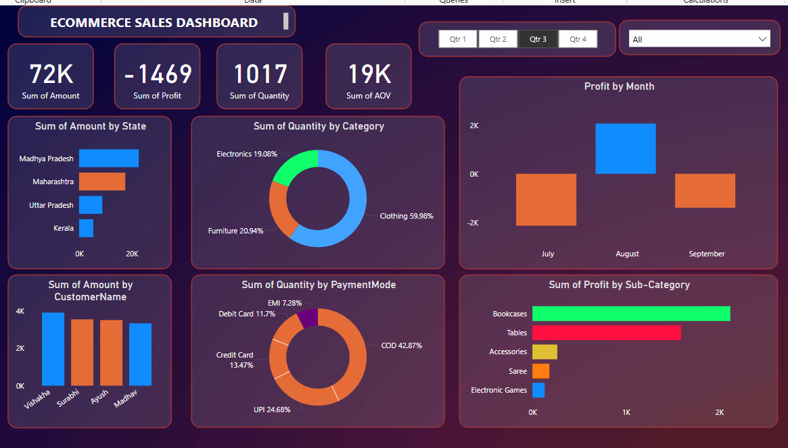

# 📊 E-commerce Sales Dashboard | Power BI



## 🚀 Project Overview

This **E-commerce Sales Dashboard** provides key insights into **sales, profit, customer behavior, and product performance** using **Power BI**. The dashboard is designed to help businesses understand **sales trends, customer preferences, and profitability** across different categories and regions.

## ❓ Problem Statement

E-commerce businesses often struggle with understanding **sales trends, customer behavior, and profit margins** across various products and regions. This project aims to **analyze and visualize key business metrics** to help decision-makers optimize sales strategies and improve profitability.

## 📊 Key Performance Indicators (KPIs)

This dashboard tracks the following **KPIs**:

1. **Total Revenue** – ₹72K (Sum of Amount)
2. **Total Profit** – ₹-1469 (Negative Profit indicates losses in certain areas)
3. **Total Quantity Sold** – 1017 units
4. **Average Order Value (AOV)** – ₹19K
5. **Sales by State** – Highest in **Madhya Pradesh**, followed by **Maharashtra**
6. **Sales by Customer** – Top customers include **Vishakha, Surabhi, Ayush, and Madhav**
7. **Product Category Performance**:
   - **Clothing** (59.98%) had the highest sales quantity.
   - **Furniture (20.94%)** and **Electronics (19.08%)** follow.
8. **Profitability by Product Sub-Category**:
   - **Bookcases** had the highest profit.
   - **Tables** contributed to major losses.
9. **Sales by Payment Mode**:
   - **COD (42.87%)** is the most preferred payment mode.
   - **UPI (24.68%)** and **Credit Cards (13.47%)** follow.

## 📊 Insights & Conclusion

- 📉 **Profitability Issues**: The company is facing losses (-₹1469). Major loss contributors include **Tables** and certain product categories.
- 📌 **High-Performing Products**: **Bookcases** generated the most profit, while **Clothing** had the highest sales quantity.
- 📍 **Regional Sales Trends**: **Madhya Pradesh** led in sales, indicating strong demand in that region.
- 💳 **Customer Payment Preferences**: **Cash on Delivery (COD) is the most used payment method (42.87%)**, which might impact cash flow management.
- 🏆 **Customer Contribution**: A few customers (Vishakha, Surabhi, Ayush, Madhav) contribute significantly to sales, indicating possible **loyal customers**.

## 🛠️ Tools & Technologies Used

- **Power BI** – Data visualization and dashboard creation.
- **SQL** – Data extraction and transformation.
- **Excel** – Data cleaning and preprocessing.
- **DAX (Data Analysis Expressions)** – Used for calculations in Power BI.

## 📢 How to Use

1. **Clone the repository**:
   ```sh
   git clone https://github.com/your-username/ecommerce-sales-dashboard.git
